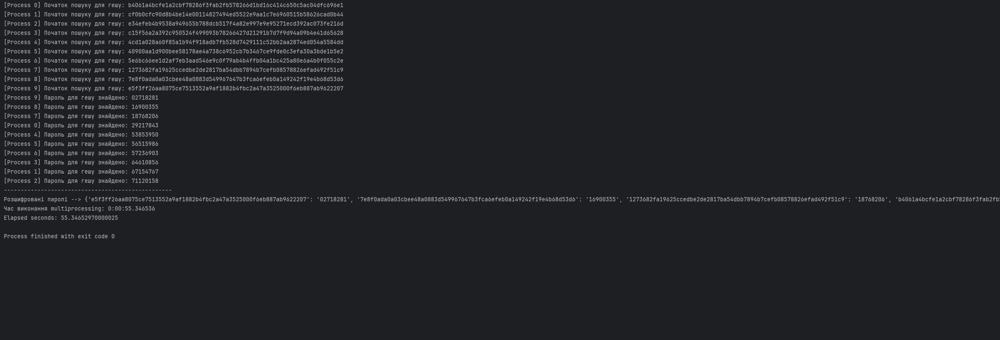
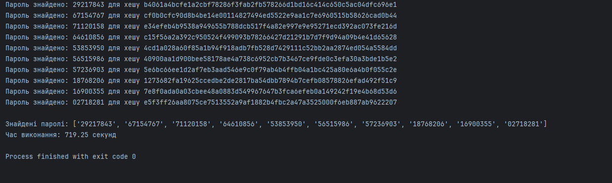

# Brute Force Passwords

> 💡 Read [the guideline](https://github.com/mate-academy/py-task-guideline/blob/main/README.md)
before starting.

Imagine you're a hacker. You've successfully SQL-injected some website's DB and got hashed passwords of 10 users:

```python
PASSWORDS_TO_BRUTE_FORCE = [
    "b4061a4bcfe1a2cbf78286f3fab2fb578266d1bd16c414c650c5ac04dfc696e1",
    "cf0b0cfc90d8b4be14e00114827494ed5522e9aa1c7e6960515b58626cad0b44",
    "e34efeb4b9538a949655b788dcb517f4a82e997e9e95271ecd392ac073fe216d",
    "c15f56a2a392c950524f499093b78266427d21291b7d7f9d94a09b4e41d65628",
    "4cd1a028a60f85a1b94f918adb7fb528d7429111c52bb2aa2874ed054a5584dd",
    "40900aa1d900bee58178ae4a738c6952cb7b3467ce9fde0c3efa30a3bde1b5e2",
    "5e6bc66ee1d2af7eb3aad546e9c0f79ab4b4ffb04a1bc425a80e6a4b0f055c2e",
    "1273682fa19625ccedbe2de2817ba54dbb7894b7cefb08578826efad492f51c9",
    "7e8f0ada0a03cbee48a0883d549967647b3fca6efeb0a149242f19e4b68d53d6",
    "e5f3ff26aa8075ce7513552a9af1882b4fbc2a47a3525000f6eb887ab9622207",
]
```

Of course, your first thought was to look through rainbow tables and test your luck.  
But after visiting the website, you realized that its password field only accepts numeric symbols from `0` to `9`.  

There’s a limitation — the password must always be **8 numeric symbols long** (*extremely weak security — you must agree*).  
Also, it seems that this website doesn’t use any additional security while hashing their passwords (like salting).

So, as a hacker, you quickly figured out that you can brute force all possible password variants  
and check the corresponding hashes using the `sha256_hash_str` function:

```python
import sha256


def sha256_hash_str(to_hash: str) -> str:
    return sha256(to_hash.encode("utf-8")).hexdigest()
```

Find the **10 passwords** (each an 8-character numeric string) and print them to the console.

- You should find **10** passwords (*not 9*) — double-check your results.
- Optimize your brute-force setup as much as possible to speed up the process.
- Attach a **screenshot of your script results (console output)** to the PR.

# Mission complete✅
- For decrypting multiple passwords, the multiprocessor approach is best suited, others will work as synchronous and will do much worse!
- In this task, the speed of finding passwords is limited only by hardware. If my processor had more cores, it could be accelerated from 55 seconds to 20 or even less. For example, you can split the search range in one to search up to half and in the other from half!
- I will provide a comparison a little lower
```
[Process 0] Початок пошуку для гешу: b4061a4bcfe1a2cbf78286f3fab2fb578266d1bd16c414c650c5ac04dfc696e1
[Process 1] Початок пошуку для гешу: cf0b0cfc90d8b4be14e00114827494ed5522e9aa1c7e6960515b58626cad0b44
[Process 2] Початок пошуку для гешу: e34efeb4b9538a949655b788dcb517f4a82e997e9e95271ecd392ac073fe216d
[Process 3] Початок пошуку для гешу: c15f56a2a392c950524f499093b78266427d21291b7d7f9d94a09b4e41d65628
[Process 4] Початок пошуку для гешу: 4cd1a028a60f85a1b94f918adb7fb528d7429111c52bb2aa2874ed054a5584dd
[Process 5] Початок пошуку для гешу: 40900aa1d900bee58178ae4a738c6952cb7b3467ce9fde0c3efa30a3bde1b5e2
[Process 6] Початок пошуку для гешу: 5e6bc66ee1d2af7eb3aad546e9c0f79ab4b4ffb04a1bc425a80e6a4b0f055c2e
[Process 7] Початок пошуку для гешу: 1273682fa19625ccedbe2de2817ba54dbb7894b7cefb08578826efad492f51c9
[Process 8] Початок пошуку для гешу: 7e8f0ada0a03cbee48a0883d549967647b3fca6efeb0a149242f19e4b68d53d6
[Process 9] Початок пошуку для гешу: e5f3ff26aa8075ce7513552a9af1882b4fbc2a47a3525000f6eb887ab9622207
[Process 9] Пароль для гешу знайдено: 02718281
[Process 8] Пароль для гешу знайдено: 16900355
[Process 7] Пароль для гешу знайдено: 18768206
[Process 0] Пароль для гешу знайдено: 29217843
[Process 4] Пароль для гешу знайдено: 53853950
[Process 5] Пароль для гешу знайдено: 56515986
[Process 6] Пароль для гешу знайдено: 57236903
[Process 3] Пароль для гешу знайдено: 64610856
[Process 1] Пароль для гешу знайдено: 67154767
[Process 2] Пароль для гешу знайдено: 71120158
--------------------------------------------------
Розшифровані паролі --> {
    'b4061a4bcfe1a2cbf78286f3fab2fb578266d1bd16c414c650c5ac04dfc696e1': '29217843',
    'cf0b0cfc90d8b4be14e00114827494ed5522e9aa1c7e6960515b58626cad0b44': '67154767',
    'e34efeb4b9538a949655b788dcb517f4a82e997e9e95271ecd392ac073fe216d': '71120158'
    'c15f56a2a392c950524f499093b78266427d21291b7d7f9d94a09b4e41d65628': '64610856',
    '4cd1a028a60f85a1b94f918adb7fb528d7429111c52bb2aa2874ed054a5584dd': '53853950',
    '40900aa1d900bee58178ae4a738c6952cb7b3467ce9fde0c3efa30a3bde1b5e2': '56515986',
    '5e6bc66ee1d2af7eb3aad546e9c0f79ab4b4ffb04a1bc425a80e6a4b0f055c2e': '57236903',
    '1273682fa19625ccedbe2de2817ba54dbb7894b7cefb08578826efad492f51c9': '18768206',
    '7e8f0ada0a03cbee48a0883d549967647b3fca6efeb0a149242f19e4b68d53d6': '16900355',
    'e5f3ff26aa8075ce7513552a9af1882b4fbc2a47a3525000f6eb887ab9622207': '02718281',
}
Час виконання multiprocessing: 0:00:55.346536
Elapsed seconds: 55.34652970000025

Process finished with exit code 0
```
- In the pictures you can see the difference of multiprocessor with async
on multiprocessor we have 55 seconds and on asyncio 700 seconds
The difference between 55 seconds and 700 seconds is approximately 1172.73%.



- if we use standard python program we wait so much
- iteration to 09999999 we wait 11 minutes 30 second
```
09999999
0 b4061a4bcfe1a2cbf78286f3fab2fb578266d1bd16c414c650c5ac04dfc696e1
1 cf0b0cfc90d8b4be14e00114827494ed5522e9aa1c7e6960515b58626cad0b44
2 e34efeb4b9538a949655b788dcb517f4a82e997e9e95271ecd392ac073fe216d
3 c15f56a2a392c950524f499093b78266427d21291b7d7f9d94a09b4e41d65628
4 4cd1a028a60f85a1b94f918adb7fb528d7429111c52bb2aa2874ed054a5584dd
5 40900aa1d900bee58178ae4a738c6952cb7b3467ce9fde0c3efa30a3bde1b5e2
6 5e6bc66ee1d2af7eb3aad546e9c0f79ab4b4ffb04a1bc425a80e6a4b0f055c2e
7 1273682fa19625ccedbe2de2817ba54dbb7894b7cefb08578826efad492f51c9
8 7e8f0ada0a03cbee48a0883d549967647b3fca6efeb0a149242f19e4b68d53d6
9 e5f3ff26aa8075ce7513552a9af1882b4fbc2a47a3525000f6eb887ab9622207
Паролі --> {'02718281': 'e5f3ff26aa8075ce7513552a9af1882b4fbc2a47a3525000f6eb887ab9622207'}
Час очікування --> 0:11:35.418647
```